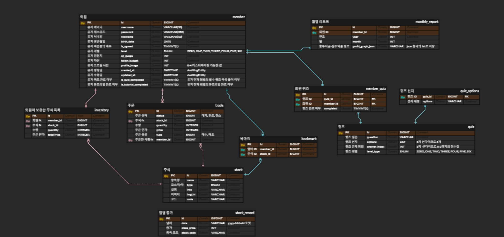

# EASY_STOCK-BE
<p align="center">
  
</p>

> 주식 투자에 입문하고 싶은 2030 세대를 위한 AI 챗봇 기반의 초보자용 모의 투자 서비스


---

##  Tech Stack

### SW Architecture 
* layered architecture

### Implementation Stack
* **CODE LEVEL** 
  - Java 17
  - Spring Boot 3.4.1
  - Spring Data JPA
  - MySQL 8.0
  - 한국투자증권 OPEN API
  <br>
- **DEPLOY**
  - Docker 
  - AWS EC2 instance
  - github workflow

---

## How to Run

1. 프로젝트 클론
```bash
git clone https://github.com/Tech-Ping/EASY_STOCK-BE.git
```

2. 환경 변수 설정 - `main/resources/application.yml`

```yaml
# application.yml
spring:
application:
name: easystock-backend
datasource:
driver-class-name: com.mysql.cj.jdbc.Driver
url: ${MYSQL_URL}
username: ${MYSQL_USERNAME}
password: ${MYSQL_PASSWORD}
hikari:
auto-commit: false
pool-name: easystock-db-pool
minimum-idle: 10
maximum-pool-size: 30
connection-timeout: 60000
... (후략)
```

3. 실행  
   IDE에서 `EasyStockApplication.java` 실행 또는

```bash
./gradlew bootRun
```

---


## 📁 API Spec Document

- [NOTION API 명세서](https://polyester-mollusk-e44.notion.site/API-17384444491a80e5901ecb66c4a2b79d?pvs=74)
- Swagger 문서 version: 실행 후 `http://localhost:8080/swagger-ui/index.html` 로 접속 후 확인 가능
- 주요 기능:
    - 실시간 주가 조회
    - 찬반 질문 응답
    - 튜토리얼 & 퀴즈 학습 API
    - 유저 투자 이력 저장/조회

---


## ER Diagram
<p align="center">
  
</p>


---


## 👩🏻‍💻 Contributors
<div>

|                  [@chock-cho](https://github.com/chock-cho)                  |                     [@nzeong](https://github.com/nzeong)                      |
|:----------------------------------------------------------------------------:|:-----------------------------------------------------------------------------:|
|  |  |

</div>
